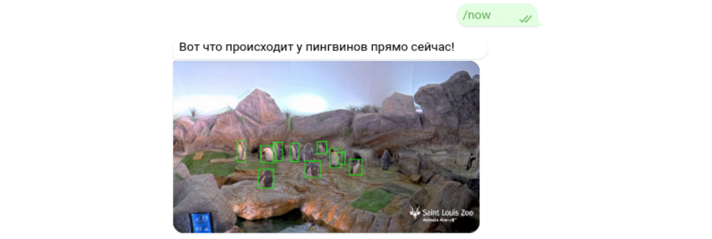

# Animal-detection

### Team members
- Tatiana Elfimova
- Yuliya Kudinova
- Daria Shutina

### Libraries / Technologies

- ML:
  - [facebook/detr-resnet-50](https://huggingface.co/facebook/detr-resnet-50) - End-to-End Object Detection with Transformers

- Backend:
  - `os` - manipulation with jpg files
  - `cv2` - highlighting an object on the image
  - `vidgear` - interaction with YouTube live streams
  - `threading` - creation of daemon processes


### Project structure
```
├── README.md
└── src
    ├── bot
    │   ├── animals.py           # Stores YouTube streams as `CamGear` instances
    │   ├── bot.py               # Contains logic and functionality for a Telegram bot           
    │   ├── daemon_processes.py  # Manages processes which are executed in the background
    │   └── sticker.webp
    ├── img_processing
    │   ├── model.py           # Detects objects on an image
    │   ├── process_image.py   # Manipulates with stream frames
    │   └── process_stream.py  # Manipulates with streams
    └── static
        ├── sources.py           # Stores links to YouTube streams
        └── word_declensions.py  # Stores declensions of russian words

```

### Functionality

Currently, animals available for monitoring are penguins🐧 and pandas🐼. 

Commands supported by the bot:
- `/add` & `/remove` - modify a list of animals that the user would like to monitor
- `/animals` - see the current list of animals
- `/now` - monitor animals in real time. The user chooses which animal they would like to see at the moment and receives a corresponding photo with highlighted animals.




Besides, the user may get a notification if something unexpected is detected. For example, a message is sent when a person enters the pengiuns' environment.


